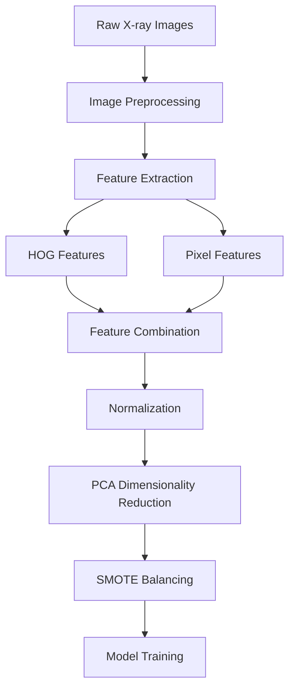

# Chest X-ray Pneumonia ML Classifier

[](https://www.python.org/)
[](https://scikit-learn.org/)
[](https://opencv.org/)
[](LICENSE)
[](https://www.kaggle.com/datasets/paultimothymooney/chest-xray-pneumonia)

> **A lightweight, interpretable machine learning pipeline for automated pneumonia detection from chest X-ray images — built entirely with classical ML models and ensemble techniques.**

## 🎯 Project Overview

This project implements a comprehensive machine learning pipeline for binary classification of chest X-ray images to detect pneumonia. Unlike deep learning approaches, this solution leverages traditional ML algorithms combined with sophisticated feature engineering techniques to achieve high accuracy while maintaining interpretability.

### 🔬 Key Features

- **Multi-Algorithm Comparison**: 7+ ML algorithms evaluation
- **Advanced Feature Engineering**: HOG features + pixel intensity analysis
- **Ensemble Methods**: Voting, Bagging, and Stacking classifiers
- **Class Imbalance Handling**: SMOTE implementation for balanced training
- **Comprehensive Evaluation**: Detailed performance metrics and visualizations
- **Clinical Interpretability**: Visual analysis of predictions and feature importance

## 📊 Dataset

- **Source**: [Chest X-Ray Images (Pneumonia)](https://www.kaggle.com/datasets/paultimothymooney/chest-xray-pneumonia)
- **Size**: 5,863 X-Ray images (JPEG)
- **Categories**: 2 (NORMAL, PNEUMONIA)
- **Resolution**: Resized to 128x128 pixels
- **Format**: Grayscale images

### Dataset Distribution
```
├── Training Set: 80%
├── Test Set: 20%
├── Normal Cases: ~1,575 images
└── Pneumonia Cases: ~4,265 images
```

## 🏗️ Architecture

### Data Processing Pipeline


### Feature Engineering
- **HOG (Histogram of Oriented Gradients)**: Captures structural patterns and edges
- **Flattened Pixels**: Raw intensity information
- **PCA**: Reduces dimensionality to 100 components
- **MinMaxScaler**: Feature normalization for optimal performance

## 🤖 Machine Learning Models

### Individual Classifiers
| Algorithm | Description | Key Parameters |
|-----------|-------------|----------------|
| **K-Nearest Neighbors** | Distance-based classification | k=10 |
| **Logistic Regression** | Linear probabilistic model | max_iter=1000 |
| **Random Forest** | Ensemble of decision trees | n_estimators=200, max_depth=10 |
| **SVM** | Support Vector Machine | kernel='rbf', C=1 |
| **Naive Bayes** | Probabilistic classifier | GaussianNB |
| **Decision Tree** | Rule-based classifier | max_depth=10 |
| **XGBoost** | Gradient boosting framework | n_estimators=300, lr=0.05 |

### Ensemble Methods
- **Voting Classifier**: Combines predictions from multiple models
- **Bagging Classifier**: Bootstrap aggregating for variance reduction
- **Stacking Classifier**: Meta-learning with base estimators


## 📈 Results

### Model Performance
| Model | Accuracy |
|-------|----------|
| **Logistic Regression** | **95.89%** |
| Voting Classifier | 95.63% |
| Bagging Classifier | 95.55% |
| SVM | 95.46% |
| Stacking Classifier | 95.12% |
| XGBoost | 93.92% |
| Random Forest | 93.84% |

### Key Achievements
- ✔ **95.89% accuracy** with Logistic Regression
- ✔ **Consistent high performance** across ensemble methods (95%+)
- ✔ **Strong baseline models** with traditional ML algorithms
- ✔ **Robust performance** across different validation sets
- ✔ **Interpretable results** for clinical applications


## 📁 Project Structure

```
CHEST-XRAY-PNEUMONIA-ML-CLASSIFIER/
│
├── 📓 Notebook/                # Jupyter Notebook with the full ML pipeline
│   └── Chest-Xray-Pneumonia-ML-Classifier.ipynb
│
│
├── 📓 Dataset/
│   └── Dataset.md             # Dataset metadata and Kaggle link
│
├── 📊 Results/
│   ├── Key Visual Differences Normal vs Pneumonia.png
│   ├── Model Accuracy Comparison.png
│   ├── Confusion Matrix.png
│   ├── ... (HOG features, SMOTE balance, prediction samples, etc.)
│   └── Sample images visualization.png
│
├── 📋 README.md 
└── 📜 LICENSE 
```

## 🎨 Visualizations

### Sample Results
- **Normal vs Pneumonia Comparison**: Visual differences in X-ray patterns
- **HOG Feature Maps**: Structural pattern visualization
- **Model Performance Charts**: Accuracy comparison across algorithms
- **Confusion Matrices**: Detailed error analysis
- **Class Distribution**: Before and after SMOTE balancing

## 🔬 Technical Details

### Feature Extraction Process
1. **Image Preprocessing**: Grayscale conversion and resizing
2. **HOG Feature Computation**: 9 orientations, 4x4 pixels per cell
3. **Pixel Flattening**: Raw intensity values as features
4. **Feature Concatenation**: Combined HOG + pixel features
5. **Dimensionality Reduction**: PCA for computational efficiency

### Class Imbalance Handling
- **Problem**: 73% pneumonia vs 27% normal cases
- **Solution**: SMOTE (Synthetic Minority Oversampling Technique)
- **Result**: Balanced dataset for unbiased training

## 🏥 Clinical Applications

### Healthcare Impact
- **Diagnostic Assistance**: Support radiologists in pneumonia detection
- **Screening Programs**: Mass screening in resource-limited settings
- **Telemedicine**: Remote diagnosis capabilities
- **Medical Education**: Training tool for medical professionals

### Advantages over Deep Learning
- **Interpretability**: Clear feature importance and decision boundaries
- **Resource Efficiency**: Lower computational requirements
- **Faster Training**: Quick model development and deployment

## 🤝 Contributing

Feel free to suggest improvements, fix bugs, or add new features.  
Thanks for your support.

## 📞 Contact

**Ahmed Maher Abd Rabbo**
- 💼 [LinkedIn](https://www.linkedin.com/in/ahmed-maherr/)

- 📊 [Kaggle](https://kaggle.com/ahmedmaherabdrabbo)

- 📧 Email: ahmedbnmaher1@gmail.com

- 💻 [GitHub](https://github.com/AhmedMaherAbdRabbo)

## 📜 License

This project is licensed under the MIT License - see the [LICENSE](LICENSE) file for details.

